# ĦCommunicator

ĦCommunicator is the world's first & only blackout-resilient radio meshnet ecosystem messenger and most feature-rich modular all-in-one community app for communication, commerce, payments, telephony & more, that you can use to build free market societies in crisis regions and beyond. The ĦCommunicator is the platform for the new autonomous Free World Meshnet Society & Economy. It is built entirely on the Free World Dollar (FWD), the only debt- and inflation-free digital real money system, the world will ever need.

 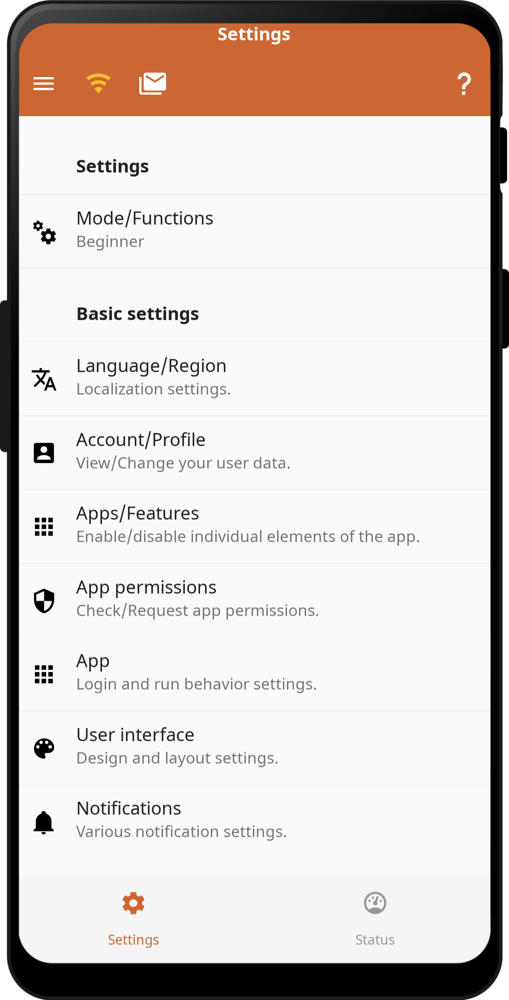 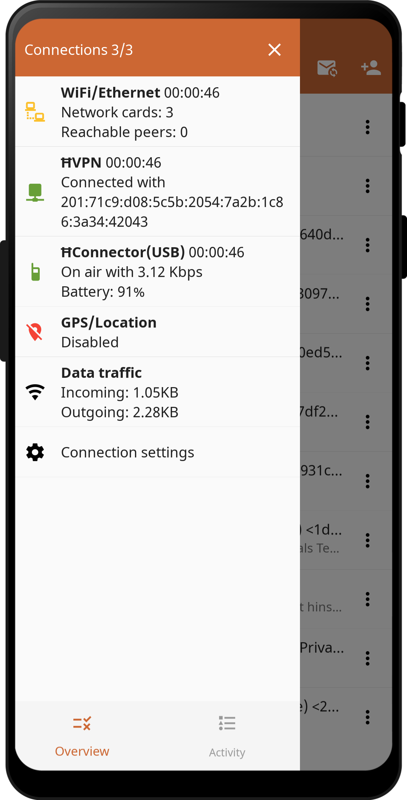
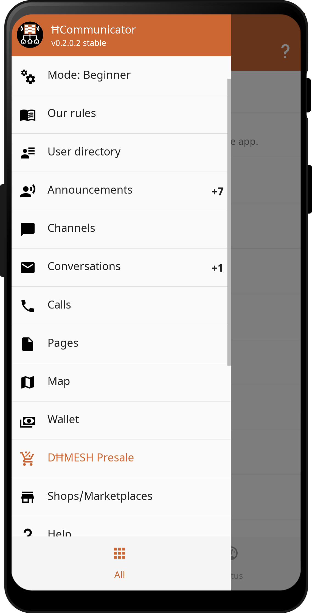 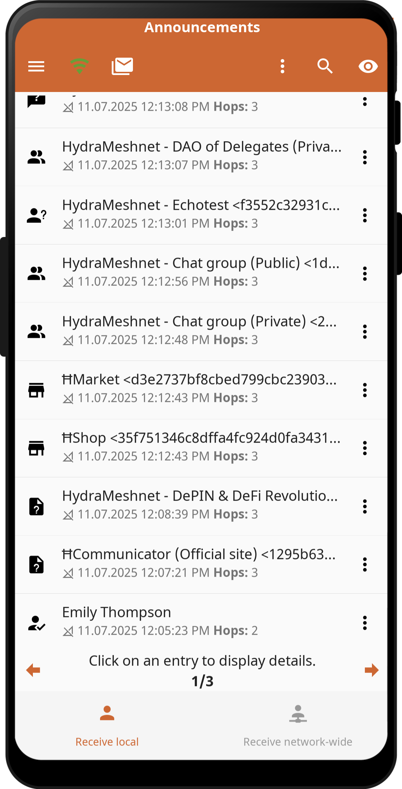 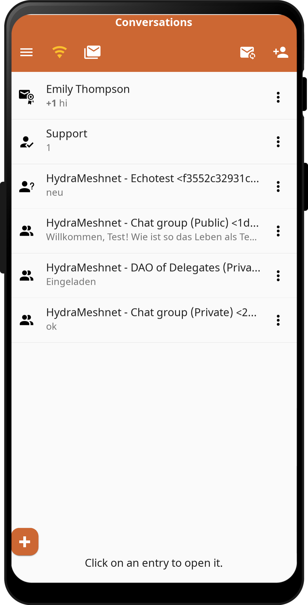
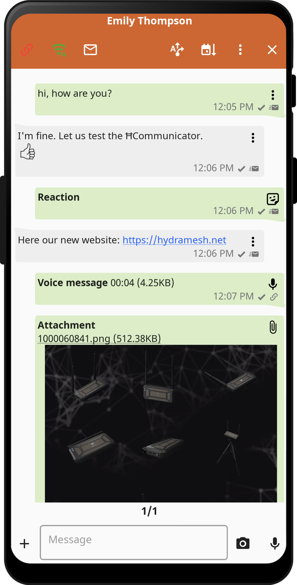 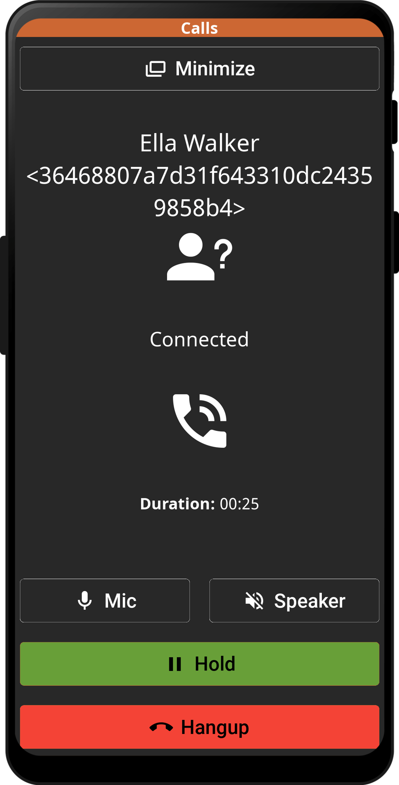 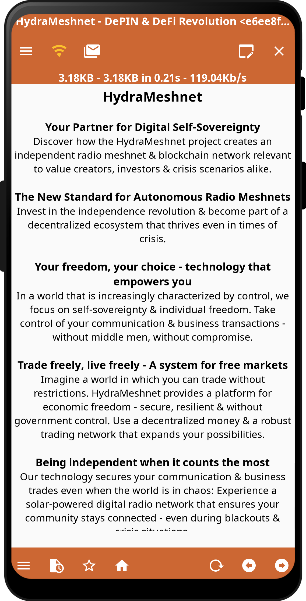
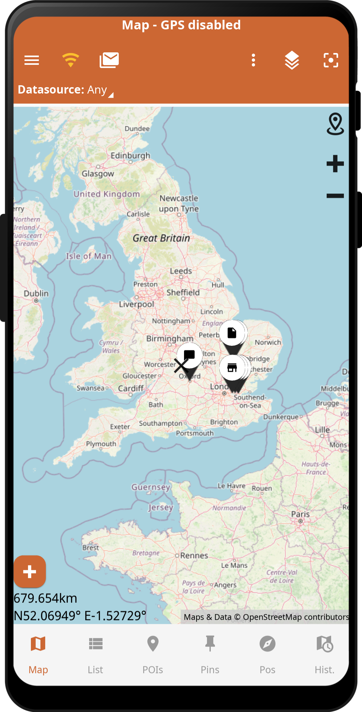 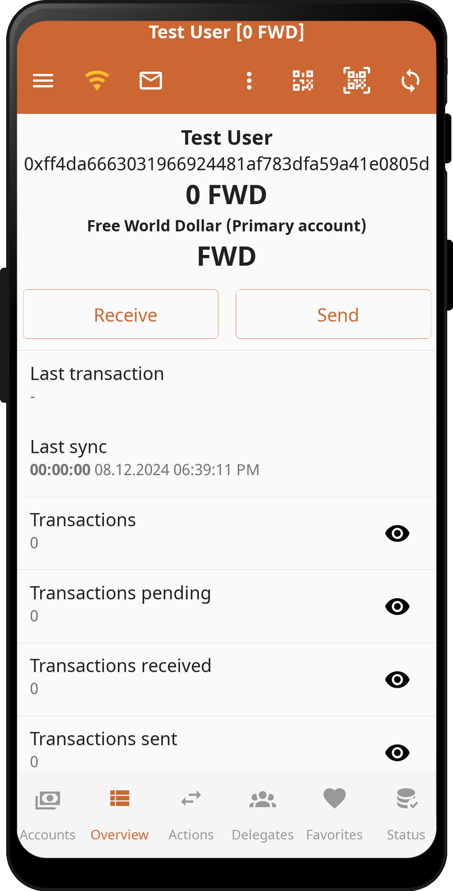 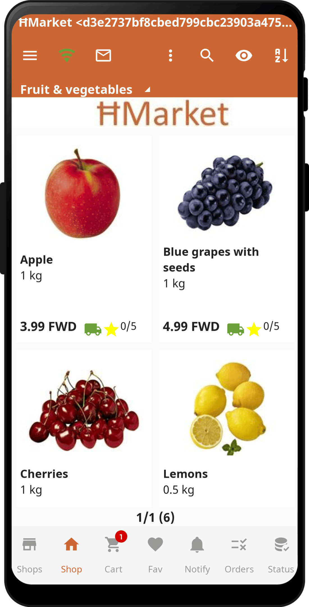

## Current status
This is currently a minimal viable product (MVP).

All core features are implemented and working.

There will be continous improvements and functional enhancements in future updates.

## Getting Started
Download the APK file from the current [Releases](https://github.com/HydraMeshnet/HCommunicator/releases) and install it.

## Apps/Features (Overview)
- **Decentralized mesh network:** Don't rely on central providers. Become your own network operator in your region.
- **Various connection types:** Unstoppable communication and trade anywhere and anytime
  Use ĦConnector LoRaPay or ĦConenctor Maxi for long distances, Bluetooth to those around you, WiFi at home or on the road, ĦVPN over any available internet connection, any other interface which Reticulum supports.
- **Secure transport encryption:** Asymmetric X25519 encryption and Ed25519 signatures.
- **Keep your account:** Your account identity and keys are stored locally and encrypted with your seed phrase.
- **Auto discovery:** Discover other peers and nodes in the mesh or query the network directory.
- **Store & Forward:** Decentralized message cache for offline peers.
- **Emergency alert:** Receive and send emergency alerts.
- **Directory:** Search the global network-wide address book for people and nodes.
- **P2P Chat & Audio Calls:** Communicate end-to-end encrypted with other users. Use voice messages, voice calls, attachments, photos, polls, share your location, ...
- **Channels/Groups:** Use server-based group chats or join channels to receive information.
- **Pages:** Browse the internal "mesh internet".
- **Map/Location:** Display positions of other users or services. (Only if the user share this.)
- **Shops/Marketplaces:** Marketplace for free exchange of goods within the network. An interactive resilient trading platform.
- **Telemetry:** Share telemetry, such as location and sensor data, with people or other systems.
- **Wallet:** Crypto wallet to send/receive crypto currencies.
- **Node/Server management:** Integrated simple management UI for administration of mesh network nodes or servers.
- **Tools:** Various tools for analyzing and testing the mesh.
- **Plugins:** Flexible plugin system for integration into app functions and UI.
- **Macros and commands:** Define custom macros or commands to perform specific actions.
- **Integrated QR code system:** Share your identity, objects, or payments with others via QR codes.
- **Backup/Restore:** Automatic backup, export, and import of your account. Migrate to a new device.
- **Multilingual and multiple UI modes:** Internationally usable, suitable for beginners and professionals.
- **Highly customizable:** Enable/Disable features, change UI and behavior.
- ...

## Connection types
- **ĦVPN:** Use any internet connection such as WiFi, 4G/5G. Stay private and anonymous by using integrated ĦVPN (Yggdrasil).
- **WiFi/WLAN:** Use any WiFi network for direct communication between the devices. For example, a public hotspot, your home network, or a smartphone hotspot.
- **Bluetooth:** Use a direct connection between the smartphones. They must be paired first.
- **Bluetooth LE:** Use a direct connection between the smartphones. Automatic connection and building of the mesh.
- **ĦConnector LoRaPay:** Affordable entry-level radio module for middle range with very low data rates. Only usable for payments and short emergency messages. Recommended for user access or one hop to bridge a gap to users.
- **ĦConnector Maxi:** High-end radio module for long range with high data rates. Recommended for buidling the "core/backbone" mesh network.
- **Any other interface Reticulum supports:** Such as TCP Client/Server, UDP Client/Server, Radio modem, Serial, I2P, ...

## Apps/Features (Details)
The following list contains all features that can be individually activated/deactivated in the app. This allows you to customize the app to your needs.

- **Emergency alert:** Receive and send emergency alerts. You can send different predefined alerts to request help. In the settings you can define your recipients for the alert. You can also receive general warnings and disaster alerts.
- **Announcements:** Display of all users and nodes available in the network. This app is the starting point to start a communication or interaction with new/unknown peers. All devices that are in the network and send an announcement are listed here.
- **Archive:** Archive elements. This can be used to archive elements that are no longer needed before they are finally deleted.
- **Backup/Restore:** Backup all data/configuration of the app. The backup can be automated. There are various settings for this in basic settings. In addition, a manual backup can be performed. The data can then be restored on the same or a new device.
- **Block:** "Block function for individual users/accounts. This allows you to exclude spammers by adding them to the block list. This will directly discard incoming messages.
- **Network-wide messages:** (Function not yet implemented.)
- **Local messages:** Messages in the local area/network. These messages are sent as a broadcast to all active users in the surrounding area. These messages are not propagated or forwarded over multiple hops.
- **Calendars/Events:** (Function not yet implemented.)
- **Calls:** Peer to Peer audio calls via the digital meshnetwork. A fast connection is required for error-free operation.
- **Channels:** Subscribing to network-wide channels and info messages. You can only receive messages and not have a conversation.
- **Conversations:** Peer to peer and group conversations. Various data can be sent as messages such as text, voice messages, attachments, photos, documents, etc.
- **Directory:** Local/own contact list and network-wide contact list. Manage your own contacts in your address book or search the global network-wide address book for people and nodes. These network-wide contacts, along with the announcements, serve as an entry point to start a conversation. (Only network-wide contacts implemented.)
- **Events:** Display all app internal events like start/stop, interfaces/connections, automatic actions and all snackbar messages like info-messages, error messages.
- **Files:** Connection to a file hoster within the network to exchange files. (Function not yet implemented.)
- **Blogs/Forums:** (Function not yet implemented.)
- **Help:** In the app integrated help for all important functions.
- **History:** History of all opened elements for quick access to them.
- **Home:** Overview page with all pinned elements.
- **Log:** Local log file creation for diagnostic purposes. The log file can be displayed, saved, shared or sent in the app. You can enable this function to analyze an error.
- **Macros:** Run user defined macros from the quick access menu.
- **Node/Server management:** Management and remote administration of nodes and servers. It can be used to manage any Linux server. The user interface and functions can be customized on the server side.
- **Map:** Locations and map functions. Display positions of other users (only if they have the gps transmission active). Exchange and create POIs. Various online map providers are available for you to choose from. Map sections that have already been displayed are cached for offline usage.
- **Message - Attachment:** Attach any files to a message and send it.
- **Message - Voice:** Record audio via microphone and send as voice message.
- **Message - Camera:** Integrated camera function to take pictures and send them as a message.
- **Message - Reaction:** In order to add a more visual and playful touch to your messages, consider responding to them with an emoji, such as a smiling face.
- **Message - Scheduled:** Send a scheduled message.
- **Message - Emoji:** Add emoji to the text message (only Linux/Windows/Mac).
- **Message - Sticker:** Add a Sticker and send it.
- **Message - Clipboard:** Paste the current content of the clipboard into the message text field.
- **Message - Contact:** Add an existing local contact and send this contact data.
- **Message - Location:** Add and send your current gps location.
- **Message - Poll:** Add/Create a poll and send it.
- **Message - Silent:** Send a silent message without notification to the recipient.
- **Message - Telemetry:** Add and send your current telemetry.
- **Message - Wallet:** Add and send a payment request.
- **Menu - Message status:** Icon in the toolbar and menu on the left side with the status of unread messages. This gives you an indication if there is any new message for you.
- **Menu - App menu:** App specific menue on the right side of the screen. This menu offers you various app specific functions which are available on the currently opened app/page.
- **Menu - Connection status:** Icon in the toolbar and menu on the left side with the status of the connections. This allows you to always have the current status of your connections directly in view.
- **Menu - Quick access:** Quick access menu on the right side of the screen with various important elements like:** Pins, unread messages, history, events. This menu offers you various comfort functions (depending on the activated function extensions). This menu can be opened by swiping from the right.
- **Devices/Objects:** Separate display of devices/objects on a separate page for better separation of normal conversations and other endpoints.
- **Pages:** Browsers to display NomadNet pages hosted on the network. You can create and manage pages and bookmarks. The browser also offers an export and share function to save the content. All displayed pages are cached for offline usage.
- **Ping:** Ping/Connection test of all peer types.
- **Pins:** Pin all different app elements such as channels, conversations, pages, stores, cards. After that they will be displayed on the home page or in the quick access menu. This allows you to collect frequently used items.
- **Plugins:** Run user defined plugins to extend the functionality of the app as desired.
- **HProve:** Create audio, video and photo recordings tamper-proof with forensic evidence of authorship, authenticity and time of creation on HydraMeshnet blockchain (ĦMESH), the native decentralized blockchain for Self-Sovereign Identity (SSI) and Digital IDentifier (DID) technology.)
- **QR code export:** Integrated QR code generator for displaying/exporting contact data, elements, messages as qr codes. The QR code can be scanned with the integrated scanner or the camera app of your device.
- **QR code scanner:** Integrated QR code scanner for reading contact data, elements, messages or any other qr codes.
- **Our rules:** Terms of use of the app.
- **Search:** Search all elements of the app from the quick access menu.
- **Server - Pages:** Integrated server function for serving pages and files which can then be displayed in the browser. This is equivalent to the NomadNet Node function. (Developers only.)
- **Server - Propagation:** Integrated server function to provide a message propagation node. It is used to cache and distribute messages for offline clients. This is equivalent to the NomadNet Node function. (Developers only.)
- **Server - Shop:** Integrated server function for serving a shop, which can be opened with any compatible app. (Developers only.)
- **Server - Webshare:** Integrated simple web server function to provide files that can then be opened with any web browser on the local network. This is to share the software and other files without installing additional apps on the client.
- **Server - :** ...
- **Configuration management:** Export/Import parts or the entire configuration as a link or qrcode. This can be shared and re-imported in another application.
- **Configuration import:** Import parts or the entire configuration which you have received as a link or qr code.
- **Share:** The app download link and your own contact data as qr code and link for easy sharing. The QR code can be scanned with the integrated scanner or the camera app of your device.
- **Shops/Marketplaces:** Marketplace for free exchange of goods within the network. An interactive resilient trading platform.
- **Status:** Show general status information of the app on the settings page. Such as software version, account/profile status, device data, software components, performance, memory information.
- **Statistic:** Statistics on all received and send elements and data traffic.
- **Support chat:** Support functionality integrated in the app for a chat with a support agent.
- **Tasks:** Managing tasks, todo lists, requests, service tickets and other organizational topics in cooperation with other users. (Function not yet implemented.)
- **Telemetry:** Securely share telemetry, such as location and sensor data, with people, custom programs, machines or other systems.
- **Templates - Emergency alert:** Use of predefined emergency alert texts for sending an alert. This makes it possible to select frequently used texts as an alert.
- **Templates - Call reject:** Use of predefined response texts for call rejection. This makes it possible to select frequently used responses and send them directly as a reject action.
- **Templates - Chat texts:** Use of predefined answer text blocks in a conversation. This makes it possible to select frequently used texts and send them directly as an answer. This feature can be accessed by clicking the add/attach button located to the left of the text input.
- **Templates - Chat CMDs:** Use of predefined commands for server/chat control. With this it is possible to send certain commands to the server to interact with it. This feature can be accessed with the command button located to the right of the text input.
- **Templates - Connections:** Predefined interface configurations for use in the connection settings.
- **Templates - Hardware:** Different hardware devices can be connected to the app. Predefined parameters for these devices are defined here. They can be selected in the hardware configuration. This simplifies switching between different configurations for a device.
- **Templates - Macros:** Predefined macros for running user defined macros from the quick access menu.
- **Templates - Management console:** Use of predefined commands for console function. With this it is possible to send certain commands to the server to interact with it. This feature can be accessed with the template button located to the left of the command input.
- **Templates - HProve texts:** Use of predefined prove text examples for text based proves.
- **Templates - Server Webshare:** Use of predefined pages examples for the webshare.
- **Templates - Shops - Orders:** Predefined order status.
- **Tools:** Various tools.
- **Tools - Announce Test:** Tool to test the announcements functionality in the reticulum network.
- **Tools - Announce View:** Tool to view the announcements in the reticulum network.
- **Tools - LoRa Bitrate & Sensitivity Calculator:** Tool for calculatinbg LoRa paramaters and see how they influence data rate and range. If you want to know what your on-air bitrate will be at certain parameters, you can use this calculator.
- **Tools - LXMF Test (Messages test):** Tool to test the lxmf message functionality in the reticulum network.
- **Tools - QR code generator:** Tool to create any qr codes. These can be exported and saved.
- **Tools - RNCP (File Upload):** Tool for file transfer to a remote system within the reticlum network.
- **Tools - ĦConnector LoRaPay - Setup:** Tool for setup hardware.
- **Tools - ĦConnector LoRaPay - Setup (Web):** Tool for setup hardware.
- **Tools - RNPath (Path/Routing Table):** Tool for path diagnostics in the reticulum network.
- **Tools - RNProbe (Connection test):** Tool for connection diagnostics in the reticulum network.
- **Tools - RNStatus (Connection status):** Tool for interface diagnostics in the reticulum network.
- **Tools - RNX (Remote console):** Tool for transferring commands in a console session to a remote system within the reticlum network.
- **Wallet:** Crypto wallet to send/receive crypto currencies. This can be used to pay directly in the shop or send money to another user.
- **Wallet Explorer:** Crypto wallet explorer to view all accounts/transactions on the blockchain. This can be used to check the accounts of other users or to verify own accounts/transactions.
- **Wallet Sale:** Buy crypto tokens.

## Installation

### Android
For your Android devices, download the APK and allow the installation.

## Copyright

Copyright (c) 2026 HydraMeshnet / hydramesh.net
All Rights Reserved.

This software is licensed under the "HydraMeshnet License", available at:
[End User License Agreement (EULA)](./EULA.md)

Unauthorized use, reproduction, or distribution of this software is prohibited.

By using this software, you agree to the terms outlined in the End User License Agreement (EULA).

For full license information, refer to: [End User License Agreement (EULA)](./EULA.md)

## Legal

- [End User License Agreement (EULA)](./EULA.md)
- [Privacy Policy](./PRIVACY.md)
