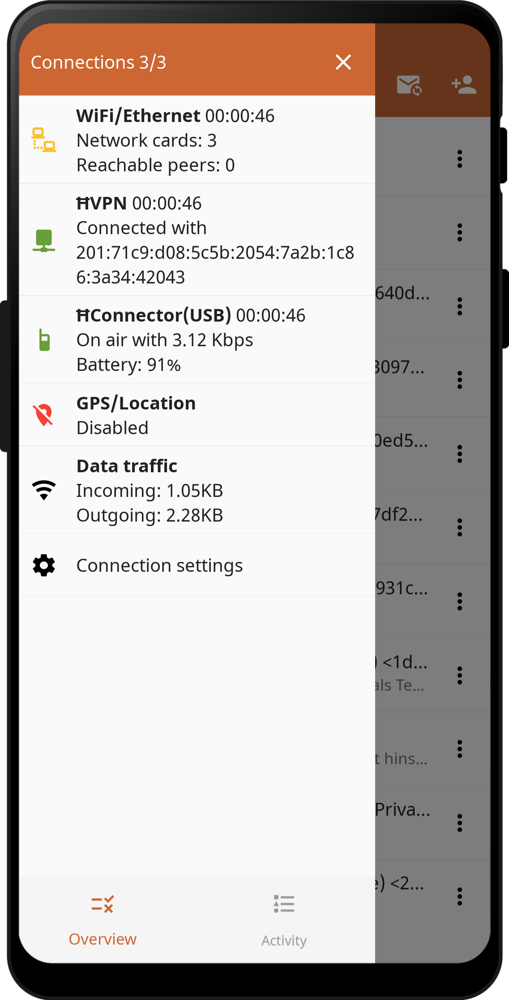
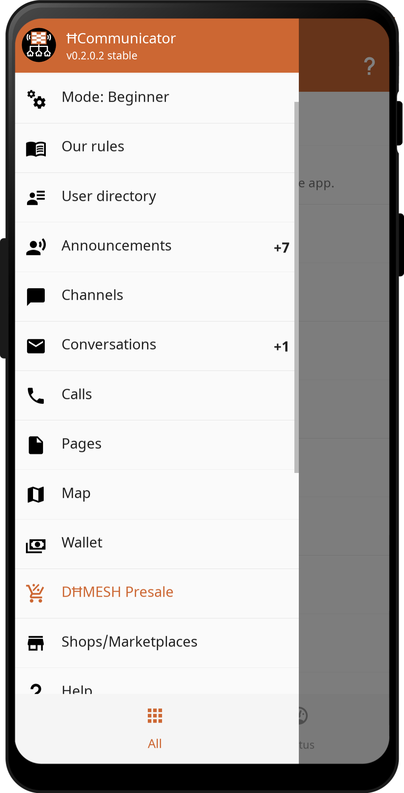
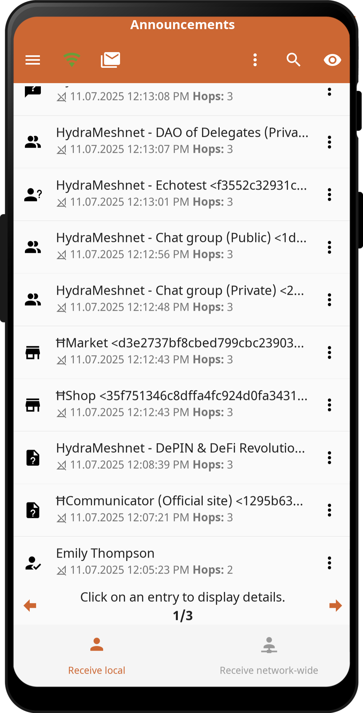
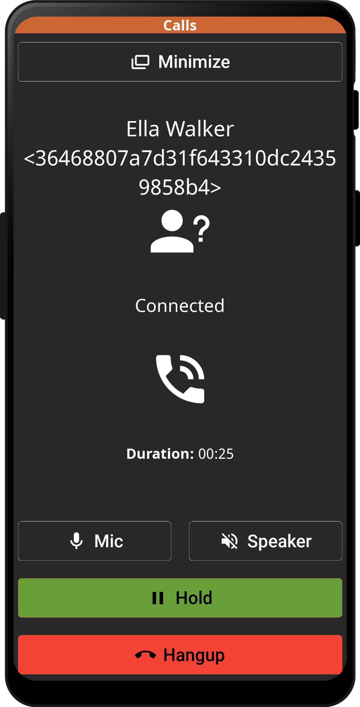

# ĦCommunicator

Der ĦCommunicator ist die funktionsreichste modulare All-in-One-Community-App für Kommunikation, wirtschaftlichen Handel, Telefonie und digitalen Zahlungsverkehr, mit der Sie freie Marktgesellschaften in Krisenregionen und darüber hinaus aufbauen können. Der ĦCommunicator ist die Plattform für die neue autarke Free World Meshnet Society & Economy. Er ist vollständig auf dem Free World Dollar (FWD) aufgebaut, dem einzigen schulden- und inflationsfreien digitalen Realgeldsystem, das die Welt jemals brauchen wird.

  
  
  
  

## Aktueller Status
Dies ist derzeit ein MVP.

Alle Kernfunktionen sind implementiert und funktionieren.

In Zukunft wird es weitere Verbesserungen und Funktionserweiterungen geben.

## Apps/Features (Übersicht)
- Entdecken von anderen Teilnehmern und Knotenpunkten
- P2P-Chat und Audioanrufe
- Kanäle/Gruppen
- Seiten
- Karte (Standort & Telemetrie)
- Geschäfte/Marktplätze
- Brieftasche
- Notfall-Warnungen
- ...
- Kompatibel mit Android, Linux, MacOS, Windows

## Apps/Funktionen (Details)
- Notfallwarnung: Empfangen und senden Sie Notfallwarnungen. Sie können verschiedene vordefinierte Alarme senden, um Hilfe anzufordern. In den Einstellungen können Sie Ihre Empfänger für den Alarm festlegen. Sie können auch allgemeine Warnungen und Katastrophenwarnungen empfangen.
- Ankündigungen: Anzeige aller im Netzwerk verfügbaren Benutzer und Knotenpunkte. Diese App ist der Ausgangspunkt, um eine Kommunikation oder Interaktion mit neuen/unbekannten Peers zu starten. Alle Geräte, die sich im Netzwerk befinden und eine Ankündigung senden, werden hier aufgelistet.
- Archiv: Elemente archivieren. Hier können nicht mehr benötigte Elemente archiviert werden, bevor sie endgültig gelöscht werden.
- Sichern/Wiederherstellen: Sichert alle Daten/Konfigurationen der App. Die Sicherung kann automatisiert werden. Dazu gibt es verschiedene Einstellungen in den Grundeinstellungen. Darüber hinaus kann ein manuelles Backup durchgeführt werden. Die Daten können dann auf dem gleichen oder einem neuen Gerät wiederhergestellt werden.
- Sperren: Sperrfunktion für einzelne Benutzer/Accounts. Damit können Sie Spammer ausschließen, indem Sie sie in die Blockierliste aufnehmen. Eingehende Nachrichten werden dadurch direkt verworfen.
- Netzwerkweite Nachrichten: (Funktion noch nicht implementiert.)
- Lokale Nachrichten: Nachrichten im lokalen Bereich/Netzwerk. Diese Nachrichten werden als Broadcast an alle aktiven Benutzer in der Umgebung gesendet. Diese Nachrichten werden nicht über mehrere Sprünge propagiert oder weitergeleitet.
- Kalender/Ereignisse: (Funktion noch nicht implementiert.)
- Anrufe: Peer to Peer Audioanrufe über das digitale Meshnetzwerk. Für einen fehlerfreien Betrieb ist eine schnelle Verbindung erforderlich.
- Kanäle: Abonnieren von netzwerkweiten Channels und Info-Nachrichten. Sie können nur Nachrichten empfangen und keine Gespräche führen.
- Unterhaltungen: Peer-to-Peer- und Gruppengespräche. Verschiedene Daten können als Nachrichten verschickt werden, z. B. Text, Sprachnachrichten, Anhänge, Fotos, Dokumente usw.
- Verzeichnis: Lokale/eigene Kontaktliste und netzwerkweite Kontaktliste. Verwalten Sie Ihre eigenen Kontakte in Ihrem Adressbuch oder durchsuchen Sie das globale netzwerkweite Adressbuch nach Personen und Knotenpunkten. Diese netzwerkweiten Kontakte dienen zusammen mit den Ankündigungen als Einstiegspunkt, um ein Gespräch zu beginnen. (Nur netzwerkweite Kontakte implementiert.)
- Ereignisse: Anzeige aller app-internen Ereignisse wie Start/Stop, Schnittstellen/Verbindungen, automatische Aktionen und alle Snackbar-Meldungen wie Info-Meldungen, Fehlermeldungen.
- Dateien: Verbindung zu einem Filehoster im Netzwerk zum Austausch von Dateien. (Funktion noch nicht implementiert.)
- Blogs/Foren: (Funktion noch nicht implementiert.)
- Hilfe: In der App integrierte Hilfe zu allen wichtigen Funktionen und Einführung, Bedienung, FAQ.
- Verlauf: Historie aller geöffneten Elemente für den schnellen Zugriff darauf.
- Startseite: Übersichtsseite mit allen angehefteten Elementen.
- Protokoll: Erstellung einer lokalen Protokolldatei für Diagnosezwecke. Die Protokolldatei kann in der App angezeigt, gespeichert, freigegeben oder gesendet werden. Sie können diese Funktion aktivieren, um einen Fehler zu analysieren.
- Makros: Führen Sie benutzerdefinierte Makros über das Schnellzugriffsmenü aus.
- Knoten/Server-Verwaltung: Verwaltung und Fernverwaltung von Knoten und Servern. Es kann zur Verwaltung jedes Linux-Servers verwendet werden. Die Benutzeroberfläche und die Funktionen können auf der Serverseite angepasst werden.
- Karte: Standorte und Kartenfunktionen. Anzeige der Positionen anderer Benutzer (nur wenn diese die GPS-Übertragung aktiviert haben). Tauschen und erstellen Sie POIs. Es stehen Ihnen verschiedene Online-Kartenanbieter zur Auswahl. Bereits angezeigte Kartenausschnitte werden für die Offline-Nutzung zwischengespeichert.
- Nachricht - Anhängen: Hängen Sie beliebige Dateien an eine Nachricht an und versenden Sie diese.
- Nachricht - Sprache: Nehmen Sie Audios über das Mikrofon auf und versenden Sie diese als Sprachnachricht.
- Nachricht - Kamera: Integrierte Kamerafunktion, um Bilder aufzunehmen und als Nachricht zu versenden.
- Nachricht - Reaktion: Um Ihren Nachrichten eine visuelle und spielerische Note zu verleihen, können Sie sie mit einem Emoji beantworten, z. B. mit einem lächelnden Gesicht.
- Nachricht - Geplant: Senden Sie eine geplante Nachricht.
- Nachricht - Emoji: Fügen Sie der Textnachricht Emoji hinzu (nur Linux/Windows/Mac).
- Nachricht - Aufkleber: Fügen Sie einen Sticker hinzu und senden Sie ihn.
- Nachricht - Zwischenablage: Fügen Sie den aktuellen Inhalt der Zwischenablage in das Textfeld der Nachricht ein.
- Nachricht - Kontakt: Fügen Sie einen bestehenden lokalen Kontakt hinzu und senden Sie diese Kontaktdaten.
- Nachricht - Standort: Fügen Sie Ihren aktuellen GPS-Standort hinzu und senden Sie ihn.
- Nachricht - Umfrage: Fügen Sie eine Umfrage hinzu/erstellen Sie sie und senden Sie sie.
- Nachricht - Stumm: Senden Sie eine stille Nachricht ohne Benachrichtigung des Empfängers.
- Nachricht - Telemetrie: Hinzufügen und Senden Ihrer aktuellen Telemetrie.
- Nachricht - Brieftasche: Hinzufügen und Versenden einer Zahlungsaufforderung.
- Menü - Nachrichtenstatus: Icon in der Symbolleiste und im Menü auf der linken Seite mit dem Status der ungelesenen Nachrichten. Dies gibt Ihnen einen Hinweis darauf, ob eine neue Nachricht für Sie vorliegt.
- Menü - App-Menü: App-spezifisches Menü auf der rechten Seite des Bildschirms. Dieses Menü bietet Ihnen verschiedene app-spezifische Funktionen, die in der aktuell geöffneten App/Seite verfügbar sind.
- Menü - Verbindungsstatus: Symbol in der Symbolleiste und im Menü auf der linken Seite mit dem Status der Verbindungen. So haben Sie den aktuellen Status Ihrer Verbindungen immer direkt im Blick.
- Menü - Schnellzugriff: Schnellzugriffsmenü auf der rechten Seite des Bildschirms mit verschiedenen wichtigen Elementen wie: Pins, ungelesene Nachrichten, Verlauf, Ereignisse. Dieses Menü bietet Ihnen verschiedene Komfortfunktionen (abhängig von den aktivierten Funktionserweiterungen). Dieses Menü kann durch Wischen von rechts geöffnet werden.
- Seiten: Browser zur Anzeige von NomadNet-Seiten, die im Netzwerk gehostet werden. Sie können Seiten und Lesezeichen erstellen und verwalten. Der Browser bietet auch eine Export- und Freigabefunktion, um den Inhalt zu speichern. Alle angezeigten Seiten werden für die Offline-Nutzung zwischengespeichert.
- Pins: Pinnen Sie alle verschiedenen App-Elemente wie Kanäle, Unterhaltungen, Seiten, Shops, Karten. Danach werden sie auf der Startseite oder im Schnellzugriffsmenü angezeigt. So können Sie häufig verwendete Elemente sammeln.
- Plugins: Führen Sie benutzerdefinierte Plugins aus, um die Funktionalität der App nach Belieben zu erweitern.
- HProve: Erstellen Sie fälschungssichere Audio-, Video- und Fotoaufnahmen mit forensischem Nachweis von Urheberschaft, Authentizität und Erstellungszeitpunkt auf der HydraMeshnet Blockchaine (ĦMESH), der nativen dezentralen Blockchain für Self-Sovereign Identity (SSI) und Digital IDentifier (DID) Technologie).
- QR-Code-Export: Integrierter QR-Code-Generator zum Anzeigen/Exportieren von Kontaktdaten, Elementen, Nachrichten als QR-Codes. Der QR-Code kann mit dem integrierten Scanner oder der Kamera-App Ihres Geräts gescannt werden. Tipp! Aktivieren Sie auch die Importfunktion.
- QR-Code-Scanner: Integrierter QR-Code-Scanner zum Einlesen von Kontaktdaten, Elementen, Nachrichten oder beliebigen anderen QR-Codes. Tipp! Aktivieren Sie auch die Exportfunktion.
- Unsere Regeln: Nutzungsbestimmungen der App.
- Server - Seiten: Integrierte Serverfunktion zur Bereitstellung von Seiten und Dateien, die dann im Browser angezeigt werden können. Dies entspricht der Funktion NomadNet Node. (Nur für Entwickler.)
- Server - Ausbreitung: Integrierte Serverfunktion zur Bereitstellung eines Nachrichtenverteilungsknotens. Er wird zum Zwischenspeichern und Verteilen von Nachrichten für Offline-Clients verwendet. Dies entspricht der Funktion NomadNet Node. (Nur für Entwickler.)
- Server - Shop: Integrierte Serverfunktion für die Bereitstellung eines Shops, der mit jeder kompatiblen App geöffnet werden kann. (Nur für Entwickler.)
- Server - Webshare: Integrierte einfache Webserver-Funktion zur Bereitstellung von Dateien, die dann mit einem beliebigen Webbrowser im lokalen Netzwerk geöffnet werden können. Dies dient dazu, die Software und andere Dateien zu teilen, ohne zusätzliche Anwendungen auf dem Client zu installieren.
- Server - ...
- Konfigurationsverwaltung: Exportieren/Importieren von Teilen oder der gesamten Konfiguration als Link oder QR-Code. Diese kann geteilt und in eine andere Anwendung reimportiert werden.
- Geschäfte/Marktplätze: Marktplatz für den freien Austausch von Waren innerhalb des Netzes.Eine interaktive, belastbare Handelsplattform.
- Status: Zeigt allgemeine Statusinformationen der App auf der Einstellungsseite an. Wie z.B. Softwareversion, Konto-/Profilstatus, Gerätedaten, Softwarekomponenten, Leistung, Speicherinformationen.
- Statistik: Statistik über alle empfangenen und gesendeten Elemente und den Datenverkehr.(Funktion noch nicht implementiert.)- Aufgaben:Verwaltung von Aufgaben, ToDo-Listen, Anfragen, Service-Tickets und anderen organisatorischen Themen in Zusammenarbeit mit anderen Benutzern.(Funktion noch nicht implementiert.)- Telemetrie: Sicherer Austausch von Telemetriedaten, wie Standort- und Sensordaten, mit Personen, benutzerdefinierten Programmen, Maschinen oder anderen Systemen.
- Aufgaben: Verwaltung von Aufgaben, ToDo-Listen, Anfragen, Service-Tickets und anderen organisatorischen Themen in Zusammenarbeit mit anderen Benutzern. (Funktion noch nicht implementiert.)
- Telemetrie: Sicherer Austausch von Telemetriedaten, wie Standort- und Sensordaten, mit Personen, benutzerdefinierten Programmen, Maschinen oder anderen Systemen.
- Vorlagen - Notfallalarm: Verwendung von vordefinierten Notfallalarmtexten für den Versand eines Alarms. Dies ermöglicht die Auswahl häufig verwendeter Texte als Alarm.
- Vorlagen - Anruf abweisen: Verwendung von vordefinierten Antworttexten für die Abweisung von Anrufen. Damit können Sie häufig verwendete Antworten auswählen und direkt als Ablehnungsaktion versenden.
- Vorlagen - Chat-Texte: Verwendung von vordefinierten Antworttextblöcken in einer Konversation. Damit können Sie häufig verwendete Texte auswählen und direkt als Antwort senden. Der Zugriff auf diese Funktion erfolgt über die Schaltfläche Hinzufügen/Anhängen, die sich links neben der Texteingabe befindet.
- Vorlagen - Chat CMDs: Verwendung von vordefinierten Befehlen zur Server/Chat-Steuerung. Damit ist es möglich, bestimmte Befehle an den Server zu senden, um mit ihm zu interagieren. Diese Funktion kann über die Befehlsschaltfläche rechts neben der Texteingabe aufgerufen werden.
- Vorlagen - Verbindungen/Schnittstellen: Vordefinierte manuelle Schnittstellenkonfiguration zur Verwendung bei der textbasierten Konfiguration beliebiger unterstützter Schnittstellen.
- Vorlagen - Hardware: Verschiedene Hardwaregeräte können mit der App verbunden werden. Hier werden vordefinierte Parameter für diese Geräte festgelegt. Sie können in der Hardware-Konfiguration ausgewählt werden. Dies vereinfacht das Umschalten zwischen verschiedenen Konfigurationen für ein Gerät.
- Vorlagen - Makros: Vordefinierte Makros für die Ausführung von benutzerdefinierten Makros über das Schnellzugriffsmenü.
- Vorlagen - Verwaltungskonsole: Verwendung von vordefinierten Befehlen für die Konsolenfunktion. Damit ist es möglich, bestimmte Befehle an den Server zu senden, um mit ihm zu interagieren. Auf diese Funktion kann über die Schaltfläche „Vorlage“ links neben der Befehlseingabe zugegriffen werden.
- Vorlagen - HProve Texte: Verwendung von vordefinierten Textbeispielen für textbasierte Beweise.
- Vorlagen - Server Webshare: Verwendung von vordefinierten Seitenbeispielen für den Webshare.
- Werkzeuge - Ankündigungstest: Tool zum Testen der Durchsagefunktionalität im Netzplan.
- Werkzeuge - Ankündigungsansicht: Tool zum Anzeigen der Durchsagen im Reticulum-Netzwerk.
- Tools - LoRa Bitrate & Empfindlichkeitsrechner: Mit diesem Tool können Sie die LoRa-Parameter berechnen und sehen, wie sie die Datenrate und Reichweite beeinflussen. Wenn Sie wissen möchten, wie hoch Ihre On-Air-Bitrate bei bestimmten Parametern sein wird, können Sie diesen Rechner verwenden.
- Werkzeuge - LXMF Test (Test der Nachrichten): Tool zum Testen der Funktionalität von LXMF-Nachrichten im Netz.
- Werkzeuge - QR-Code-Generator: Tool zum Erstellen beliebiger QR-Codes. Diese können exportiert und gespeichert werden.
- Werkzeuge - RNCP (Datei-Upload): Tool zur Dateiübertragung an ein entferntes System innerhalb des Reticlum-Netzwerks.
- Werkzeuge - RNPath (Pfad/Routing-Tabelle): Tool für die Pfaddiagnose im Reticlum-Netzwerk.
- Werkzeuge - RNProbe (Verbindungstest): Tool für die Verbindungsdiagnose im Netzplan.
- Werkzeuge - RNStatus (Verbindungsstatus): Tool für die Schnittstellendiagnose im Netz des Netzes des Netzbetreibers.
- Werkzeuge - RNX (Entfernte Konsole): Tool zur Übertragung von Befehlen in einer Konsolensitzung an ein entferntes System innerhalb des Reticlum-Netzwerks.
- Wallet: Krypto-Wallet zum Senden/Empfangen von Kryptowährungen. Damit kann man direkt im Shop bezahlen oder Geld an einen anderen Benutzer schicken.
- Wallet Explorer: Krypto-Wallet-Explorer zur Anzeige aller Konten/Transaktionen auf der Blockchain. Dies kann verwendet werden, um die Konten anderer Nutzer zu überprüfen oder um eigene Konten/Transaktionen zu verifizieren.

## Installation

### Android
Getestet mit den folgenden Android-Versionen:
- Android 7, 8, 9, 10, 11, 12, 13, 14, 15

Getestet mit den folgenden Hardware:
- Google
- Samsung
- Realme C21-Y
- Ulefone Armor 7

Laden Sie für Ihre Android-Geräte die APK herunter und erlauben Sie die Installation.

## Copyright

Copyright (c) 2025 HydraMeshnet / hydramesh.net
All Rights Reserved.

This software is licensed under the "HydraMeshnet License", available at:
[End User License Agreement (EULA)](./EULA.md)

Unauthorized use, reproduction, or distribution of this software is prohibited.

By using this software, you agree to the terms outlined in the End User License Agreement (EULA).

For full license information, refer to: [End User License Agreement (EULA)](./EULA.md)

## Legal

- [End User License Agreement (EULA)](./EULA.md)
- [Privacy Policy](./PRIVACY.md)
